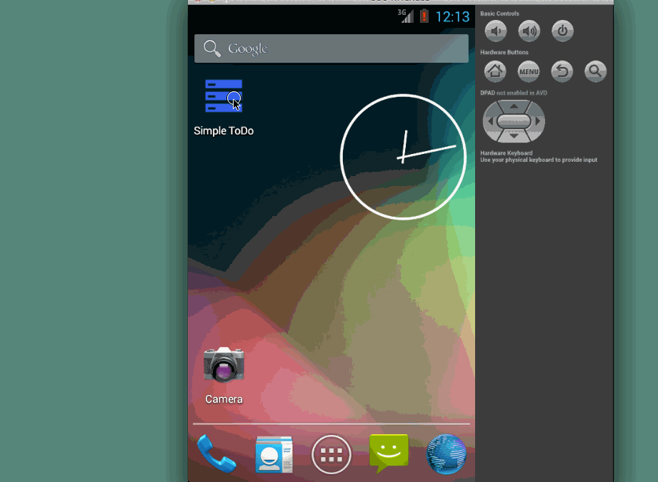

ToDo-Codepath
=============

# Demo of a simple todo list manager

This is a simple Android app to manage one's Todo list. 

Time spent: In total, 3 hours. 

Completed user stories:

 * [x] Required: User can view a list of existing todo items
 * [x] Required: User can add a new item to the todo list
 * [x] Required: User can remove an item from the todo list
 * [x] Required: User can edit an item from the todo list

Notes:

Spent some time fixing a bug which exists on Mac OS X. Here is the link I finally found after some digging which resolved the bug:
https://code.google.com/p/android/issues/detail?id=68755

Walkthrough of all user stories:

GIF created with [LiceCap](http://www.cockos.com/licecap/).

